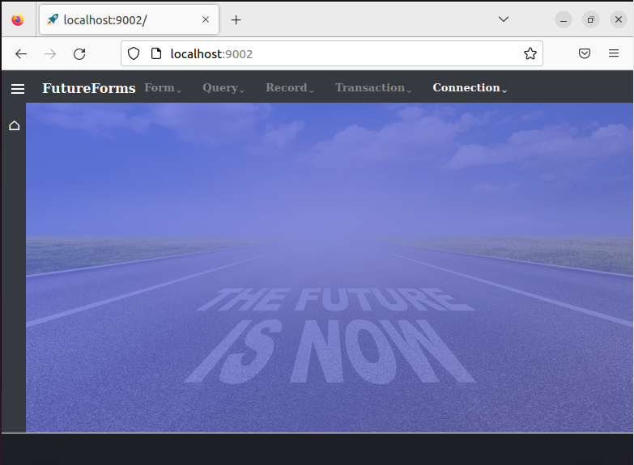
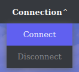
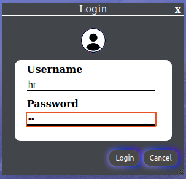
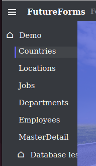
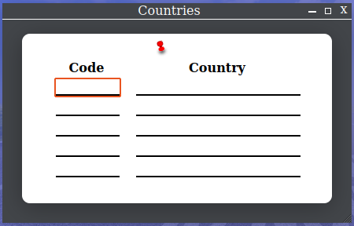
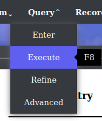
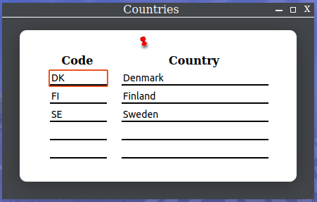

# FutureForms featured demo installation

This Ansible script will install FutureForms with the extended demo.
This demo will show what a lot of the classes in FutureForms can do.

## Requirements

This script will install a lot of TypeScript package
so it is recommended to run the script in a Ubuntu
server running on a virtual machin (VirtualBox, LXC,VmWare).
This will make a cleanup easier.


In Ubuntu this packages will be installed:

* Java
* PostgreSQL
* npm
* unzip

## Install

Start Ubuntu and install Ansible:

```
sudo apt install ansible
```

Create a directory for test and go into it:

```
mkdir ~/foo
cd ~/foo
```
Clone this repository:

```
git clone https://github.com/chlordk/ff-install
cd ff-install
```

Run the `ff-install` playbook:

```
ansible-playbook playbooks/ff_install.yml 
```
The installation, download and compilation takes about 2 minutes.

## Start database.js

`database.js` is a Java program which is the actual web server.

```
cd playbooks/database.js.demo
bin/database.js start
```
Now the web service is running on port 9002
and can be seen at http://localhost:9002/

Now the frontscreen can be seen.



Click `Connection` in the menu bar and then `Connect`.



Enter demo user `hr`and demo password `hr` to login to the database.



Click the *hamburger button* ☰ in upper left corner and then `Countries`



The empty Countries table is now shown.



Click `Query` and `Execute` in the top menu or press the key `F8`.



Now the table is filled with data from the database.


