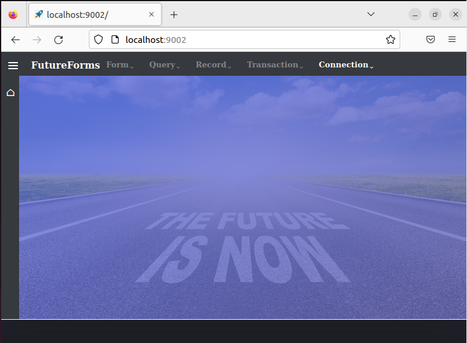
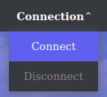
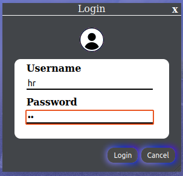
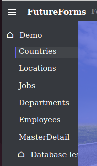
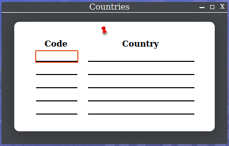
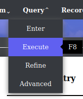
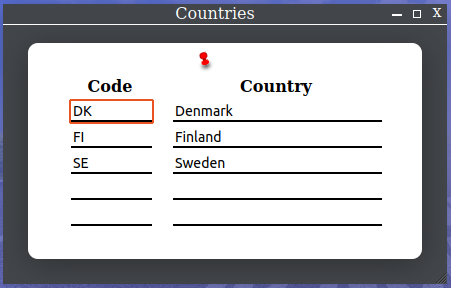

# FutureForms featured demo installation

This Ansible script will install FutureForms with the extended demo.
This demo will show what a lot of the classes in FutureForms can do.

## Requirements

Read the requirements at the [frontpage](../../README.md).

## Install

Run the `install-demo` playbook:

```
ansible-playbook install-demo.yml 
```

The installation, download and compilation takes about 3 minutes
and will take up about 1.1GB disk space.

## Start database.js

`database.js` is a Java program which is the actual web server.
Go to the directory and start the webserver:

```
cd playbooks/demo/database.js.demo
bin/database.js start
```

Now the web service is running on port 9002
and can be seen at http://localhost:9002/

Now the frontscreen can be seen.



Click `Connection` in the menu bar and then `Connect`.



Enter demo user `hr`and demo password `hr` to login to the database.



Click the *hamburger button* ☰ in upper left corner and then `Countries`



The empty Countries table is now shown.



Click `Query` and `Execute` in the top menu or press the key `F8`.



Now the table is filled with data from the database.


